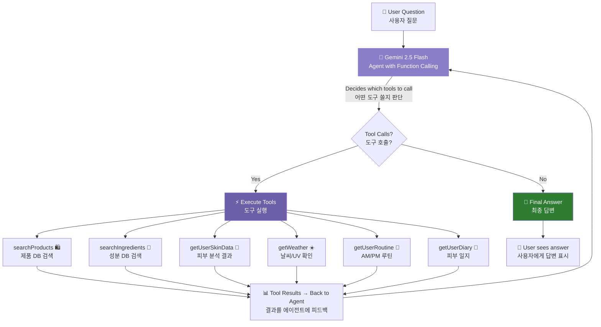

# Glowmi AI Architecture — RAG + Agentic AI

## Overview
SkinChat uses a **Single Agent with Function Calling** powered by Gemini 2.5 Flash. The AI autonomously decides which tools to call based on the user's question — searching products, checking skin data, reading weather, etc. — then synthesizes a personalized answer grounded in real data.

SkinChat은 Gemini 2.5 Flash 기반 **Single Agent + Function Calling** 구조. AI가 사용자 질문을 보고 어떤 도구를 쓸지 자율적으로 판단 — 제품 검색, 피부 데이터 조회, 날씨 확인 등 — 실제 데이터 기반 맞춤 답변 생성.

---

## Architecture (Mermaid Diagram)



## Agent Loop Flow (에이전트 루프 플로우)

```
1. User sends question (사용자가 질문)
2. Agent (Gemini) receives question + tool definitions (에이전트가 질문 + 도구 목록 받음)
3. Agent decides: "I need searchProducts + getUserSkinData" (판단: "제품 검색 + 피부 데이터 필요")
4. Tools execute in browser (브라우저에서 도구 실행)
   └─ searchProducts → Embedding → pgvector cosine search → top 5 products
   └─ getUserSkinData → Supabase query → skin scores
5. Results sent back to Agent (결과를 에이전트에 피드백)
6. Agent synthesizes final answer using tool results (도구 결과로 최종 답변 생성)
7. If more data needed → loop back to step 3 (max 3 iterations)
   추가 데이터 필요 시 → 3번으로 (최대 3회 반복)
```

---

## 6 Agent Tools (6가지 에이전트 도구)

| Tool (도구) | What it does (역할) | Data Source (데이터 소스) |
|------|------|------|
| `searchProducts` | Search K-beauty product DB by query (제품 검색) | Supabase pgvector (108 products) |
| `searchIngredients` | Search ingredient DB by query (성분 검색) | Supabase pgvector (99 ingredients) |
| `getUserSkinData` | Get user's skin scores, color type, skin type (피부 분석 결과) | Supabase `analysis_results` |
| `getWeather` | Get current temp, humidity, UV index (날씨/UV) | localStorage cache (Open-Meteo API) |
| `getUserRoutine` | Get user's AM/PM routine (AM/PM 루틴) | Supabase `routines` |
| `getUserDiary` | Get last 14 days of skin diary (피부 일지) | Supabase `skin_diary` |

---

## RAG Pipeline (within searchProducts / searchIngredients)

```
Query text
    │
    ▼
Gemini embedding-001 → 768-dim vector (768차원 벡터)
    │
    ▼
Supabase pgvector → cosine similarity search (코사인 유사도 검색)
    │ Top 5 results, similarity > 0.3
    ▼
Formatted text → fed back to Agent (에이전트에 텍스트로 피드백)
```

---

## Tech Stack

| Component (구성요소) | Technology (기술) | Role (역할) |
|---------|------|------|
| Agent / LLM | Gemini 2.5 Flash | Function calling + answer generation (도구 호출 판단 + 답변 생성) |
| Embedding (임베딩) | Gemini embedding-001 | Text → 768-dim vector (텍스트 → 벡터 변환) |
| Vector DB (벡터 DB) | Supabase pgvector | Vector storage + cosine similarity search (벡터 저장 + 유사도 검색) |
| User Data (사용자 데이터) | Supabase PostgreSQL | Skin results, routines, diary (피부 결과, 루틴, 일지) |
| Weather (날씨) | Open-Meteo API + localStorage | Temperature, humidity, UV index |
| Proxy (프록시) | Cloudflare Functions | Server-side API key protection (API 키 서버 사이드 보호) |
| Frontend (프론트엔드) | React 18 + Vite 6 | Agent loop runs in browser (에이전트 루프 브라우저 실행) |

---

## Data

- **Products (제품)**: 108 K-beauty products (cleansers, toners, serums, creams, sunscreens, etc.)
- **Ingredients (성분)**: 99 skincare ingredients (actives, humectants, emollients, botanicals, etc.)
- **Total embeddings (총 임베딩)**: 207, each 768 dimensions
- **Search index (검색 인덱스)**: IVFFlat (lists=1, optimized for small dataset)

---

## Key Files (주요 파일)

| File (파일) | Role (역할) |
|------|------|
| `src/lib/agent.js` | **Agent loop + 6 tool definitions + tool executor** (에이전트 코어) |
| `src/lib/rag.js` | Vector search: `searchProductsRAG()`, `searchIngredientsRAG()` (벡터 검색) |
| `src/lib/gemini.js` | `callGeminiAgent()` for function calling + `getEmbedding()` |
| `src/components/ai/SkinChat.jsx` | Chat UI + agent integration + fallback to RAG (채팅 UI + 에이전트 연동) |
| `functions/api/gemini.js` | Cloudflare Function — Gemini API proxy |
| `functions/api/embedding.js` | Cloudflare Function — Embedding API proxy |
| `scripts/generate-embeddings.js` | Batch embedding generation (임베딩 일괄 생성) |
| `scripts/supabase-rag-setup.sql` | pgvector table + RPC function SQL |

---

## Error Handling (에러 처리)

- **Agent fails** → falls back to RAG pipeline (에이전트 실패 → RAG 파이프라인으로 폴백)
- **RAG fails** → falls back to plain AI chat (RAG 실패 → 일반 AI 대화)
- **Individual tool fails** → returns error message, agent continues with other data (개별 도구 실패 → 에러 메시지 반환, 다른 데이터로 계속)
- **Max 3 iterations** → prevents infinite agent loops (최대 3회 반복 → 무한 루프 방지)
- **5-8s timeout per tool** → prevents hanging (도구당 5-8초 타임아웃)
- **similarity < 0.3** → filtered out (유사도 0.3 미만 필터링)

---

## API Key Flow (API 키 흐름)

```
Production (프로덕션):
  Browser → /api/gemini (Cloudflare Function) → Gemini API
  GEMINI_API_KEY stored as Cloudflare Secret — never exposed to browser
  API 키는 Cloudflare Secret에 저장 — 브라우저에 노출 안 됨

Local Dev (로컬 개발):
  Browser → Gemini API (direct call)
  VITE_GEMINI_API_KEY loaded from .env file
  .env 파일에서 키 로드
```

---

## Example Interactions (사용 예시)

**Product recommendation (제품 추천):**
> User: "선크림 추천해줘"
> Agent calls: `getUserSkinData` → `searchProducts("sunscreen")`
> Shows: "제품 검색 중..." → "피부 데이터 확인 중..."
> Answer: "건성 피부시니까 **Beauty of Joseon Relief Sun** 추천해요! 프로바이오틱스 성분이라 보습도 되고..."

**Weather-aware advice (날씨 맞춤 조언):**
> User: "오늘 스킨케어 어떻게 해?"
> Agent calls: `getWeather` → `getUserSkinData` → `searchProducts`
> Answer: "오늘 UV 지수가 7로 높네요! SPF 50 필수고, 습도가 낮으니 히알루론산 세럼 추천..."

**Routine optimization (루틴 최적화):**
> User: "내 루틴 괜찮아?"
> Agent calls: `getUserRoutine` → `getUserSkinData` → `searchIngredients`
> Answer: "AM 루틴에 비타민C 세럼이 빠져 있네요. 건성 피부에 항산화 보호가 중요하니..."
