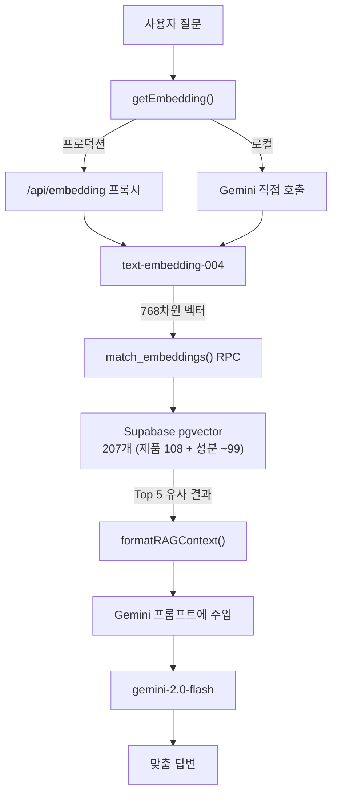

# Glowmi RAG Architecture

SkinChat에 RAG(Retrieval-Augmented Generation)를 적용하여 우리 DB의 제품/성분 데이터를 기반으로 맞춤 추천을 제공합니다.

## Flow

## Files

| File | Role |
|------|------|
| `functions/api/embedding.js` | Cloudflare Function — Gemini 임베딩 프록시 |
| `scripts/generate-embeddings.js` | 임베딩 일괄 생성 (일회성) |
| `scripts/supabase-rag-setup.sql` | Supabase 테이블 + RPC 함수 SQL |
| `src/lib/rag.js` | 벡터 검색 + 결과 포맷팅 |
| `src/lib/gemini.js` | `getEmbedding()` + `chatSkincare` RAG 통합 |
| `src/components/ai/SkinChat.jsx` | RAG를 chat flow에 연결 |

## Setup

1. Supabase SQL Editor에서 `scripts/supabase-rag-setup.sql` 실행
2. `npm run generate-embeddings` 실행 (한 번만)
3. Cloudflare에 `GEMINI_API_KEY` 설정 확인 (기존과 동일)

## Design Decisions

- **테이블 1개**: product + ingredient 합쳐서 `embeddings` 테이블 (207개로 분리 불필요)
- **양국어 임베딩**: 영어+한국어 텍스트를 합쳐서 임베딩 (어느 언어로 질문해도 검색 가능)
- **RAG 실패 시 폴백**: 벡터 검색 실패해도 기존 chatSkincare 그대로 동작
- **프록시 분리**: embedding.js를 별도 파일로 (기존 gemini.js는 generateContent 전용)
- **추가 비용 0원**: Gemini 임베딩 무료 + Supabase pgvector 무료 플랜 포함
