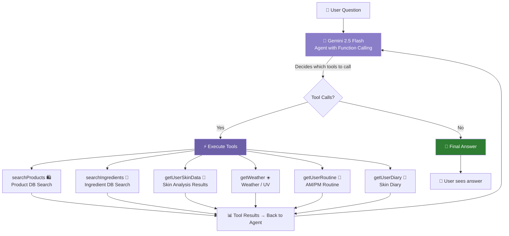
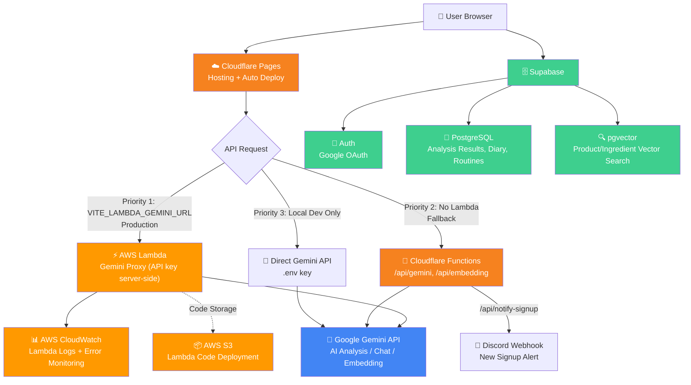

# Glowmi AI Architecture — RAG + Agentic AI

## Overview

SkinChat uses a **Single Agent with Function Calling** powered by Gemini 2.5 Flash. The AI autonomously decides which tools to call based on the user's question — searching products, checking skin data, reading weather, etc. — then synthesizes a personalized answer grounded in real data.

---

## Architecture



## Agent Loop Flow

```
1. User sends question
2. Agent (Gemini) receives question + tool definitions
3. Agent decides: "I need searchProducts + getUserSkinData"
4. Tools execute in browser
   └─ searchProducts → Embedding → pgvector cosine search → top 5 products
   └─ getUserSkinData → Supabase query → skin scores
5. Results sent back to Agent
6. Agent synthesizes final answer using tool results
7. If more data needed → loop back to step 3 (max 3 iterations)
```

---

## 6 Agent Tools

| Tool | What it does | Data Source |
|------|------|------|
| `searchProducts` | Search K-beauty product DB by query | Supabase pgvector (108 products) |
| `searchIngredients` | Search ingredient DB by query | Supabase pgvector (99 ingredients) |
| `getUserSkinData` | Get user's skin scores, color type, skin type | Supabase `analysis_results` |
| `getWeather` | Get current temp, humidity, UV index | localStorage cache (Open-Meteo API) |
| `getUserRoutine` | Get user's AM/PM routine | Supabase `routines` |
| `getUserDiary` | Get last 14 days of skin diary | Supabase `skin_diary` |

---

## RAG Pipeline (within searchProducts / searchIngredients)

```
Query text
    │
    ▼
Gemini embedding-001 → 768-dim vector
    │
    ▼
Supabase pgvector → cosine similarity search
    │ Top 5 results, similarity > 0.3
    ▼
Formatted text → fed back to Agent
```

---

## Infrastructure Architecture



---

## Tech Stack

| Component | Technology | Role |
|---------|------|------|
| Agent / LLM | Gemini 2.5 Flash | Function calling + answer generation |
| Embedding | Gemini embedding-001 | Text → 768-dim vector |
| Vector DB | Supabase pgvector | Vector storage + cosine similarity search |
| User Data | Supabase PostgreSQL | Skin results, routines, diary |
| Weather | Open-Meteo API + localStorage | Temperature, humidity, UV index |
| Proxy — Production | AWS Lambda | Gemini API proxy + API key secured in Lambda env vars |
| Proxy — Fallback | Cloudflare Functions | Backup proxy when Lambda unavailable |
| Monitoring | AWS CloudWatch | Lambda execution logs, error tracking, invocation metrics |
| Storage | AWS S3 | Lambda function code deployment |
| Hosting | Cloudflare Pages | Static site hosting + auto-deploy from GitHub main |
| Notifications | Discord Webhook | New signup alerts via Cloudflare Function |
| Frontend | React 18 + Vite 6 | Agent loop runs in browser |

---

## Data

- **Products**: 108 K-beauty products (cleansers, toners, serums, creams, sunscreens, etc.)
- **Ingredients**: 99 skincare ingredients (actives, humectants, emollients, botanicals, etc.)
- **Total embeddings**: 207, each 768 dimensions
- **Search index**: IVFFlat (lists=1, optimized for small dataset)

---

## Skin Analysis → Product Recommendation → Routine Pipeline

```
[1] Skin analysis complete → scores { redness, oiliness, dryness, darkSpots, texture }
         │
[2] skinScoresToQueries(scores) → Convert 40+ concern scores to search queries (no Gemini call)
         │
[3] searchProductsForRoutine(scores) → Parallel RAG search → 15~20 products + category grouping
         │
[4] Results screen: RAG-based recommended products (with Amazon links)
         │
[5] "Get AI Routine" → generateRoutineWithRAG(scores, ragProducts)
         │  → Send skin scores + real product list to Gemini → Build AM/PM routine with real products
         │
[6] Routine displays real products + brands + Amazon links + recommendation reasons
```

| Step | Function | File | Gemini Call |
|------|------|------|-------------|
| Query conversion | `skinScoresToQueries` | `src/lib/rag.js` | None (keyword map) |
| RAG search | `searchProductsForRoutine` | `src/lib/rag.js` | Embedding 2~3x |
| Routine generation | `generateRoutineWithRAG` | `src/lib/gemini.js` | Text 1x |

**Fallback**: RAG fails → `getRecommendations()` (local), Routine fails → `generateRoutineAI()` (virtual products)

---

## Key Files

| File | Role |
|------|------|
| `src/lib/agent.js` | Agent loop + 6 tool definitions + tool executor |
| `src/lib/rag.js` | Vector search: `searchProductsRAG()`, `searchIngredientsRAG()` |
| `src/lib/gemini.js` | `callGeminiAgent()` for function calling + `getEmbedding()` |
| `src/components/ai/SkinChat.jsx` | Chat UI + agent integration + fallback to RAG |
| `functions/api/gemini.js` | Cloudflare Function — Gemini API proxy |
| `functions/api/embedding.js` | Cloudflare Function — Embedding API proxy |
| `scripts/generate-embeddings.js` | Batch embedding generation |
| `scripts/supabase-rag-setup.sql` | pgvector table + RPC function SQL |

---

## Error Handling

- **Agent fails** → falls back to RAG pipeline
- **RAG fails** → falls back to plain AI chat
- **Individual tool fails** → returns error message, agent continues with other data
- **Max 3 iterations** → prevents infinite agent loops
- **5-8s timeout per tool** → prevents hanging
- **similarity < 0.3** → filtered out

---

## API Key Flow

```
Production — 3-tier priority:

  Priority 1: AWS Lambda (VITE_LAMBDA_GEMINI_URL set)
  Browser → Lambda → Gemini API
  GEMINI_API_KEY stored in Lambda environment variables
  API key never exposed to browser
  CloudWatch logs all calls and errors

  Priority 2: Cloudflare Functions (Lambda failure fallback)
  Browser → /api/gemini (Cloudflare Function) → Gemini API
  GEMINI_API_KEY stored as Cloudflare Secret

Local Dev:
  Browser → Gemini API (direct call)
  VITE_GEMINI_API_KEY loaded from .env file
```

---

## Example Interactions

**Product recommendation:**
> User: "Recommend a sunscreen"
> Agent calls: `getUserSkinData` → `searchProducts("sunscreen")`
> Shows: "Searching products..." → "Checking skin data..."
> Answer: "Since you have dry skin, I recommend **Beauty of Joseon Relief Sun**! It has probiotics for moisture too..."

**Weather-aware advice:**
> User: "What skincare should I do today?"
> Agent calls: `getWeather` → `getUserSkinData` → `searchProducts`
> Answer: "Today's UV index is 7 — quite high! SPF 50 is a must, and since humidity is low, try a hyaluronic acid serum..."

**Routine optimization:**
> User: "Is my routine okay?"
> Agent calls: `getUserRoutine` → `getUserSkinData` → `searchIngredients`
> Answer: "Your AM routine is missing a Vitamin C serum. Antioxidant protection is important for dry skin..."
