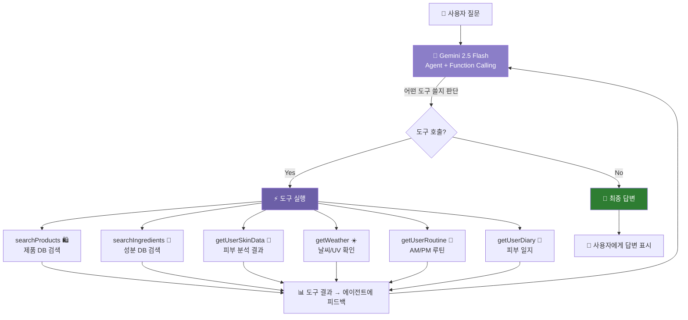
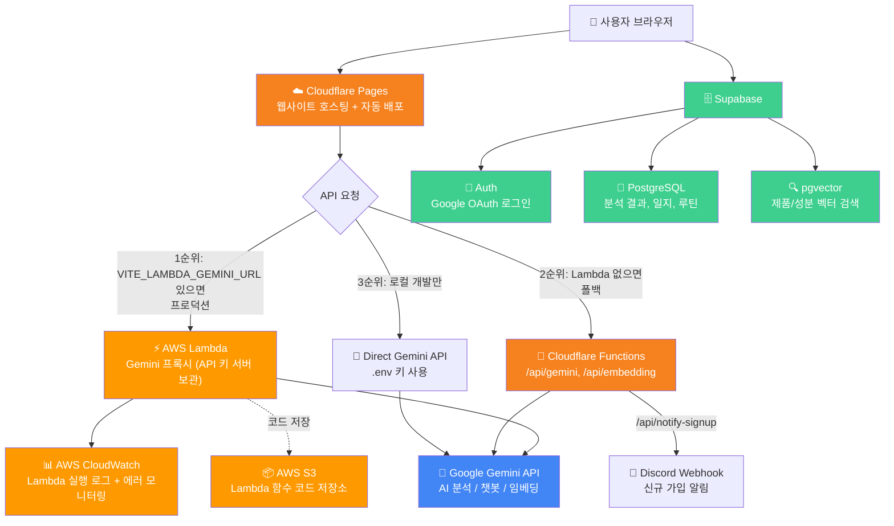

# Glowmi AI 아키텍처 — RAG + 에이전트 AI

## 개요

SkinChat은 Gemini 2.5 Flash 기반 **Single Agent + Function Calling** 구조. AI가 사용자 질문을 보고 어떤 도구를 쓸지 자율적으로 판단 — 제품 검색, 피부 데이터 조회, 날씨 확인 등 — 실제 데이터 기반 맞춤 답변 생성.

---

## 아키텍처



## 에이전트 루프 플로우

```
1. 사용자가 질문
2. 에이전트(Gemini)가 질문 + 도구 목록 받음
3. 에이전트 판단: "제품 검색 + 피부 데이터 필요"
4. 브라우저에서 도구 실행
   └─ searchProducts → 임베딩 → pgvector 코사인 검색 → 상위 5개 제품
   └─ getUserSkinData → Supabase 쿼리 → 피부 점수
5. 결과를 에이전트에 피드백
6. 도구 결과로 최종 답변 생성
7. 추가 데이터 필요 시 → 3번으로 (최대 3회 반복)
```

---

## 6가지 에이전트 도구

| 도구 | 역할 | 데이터 소스 |
|------|------|------|
| `searchProducts` | K-뷰티 제품 검색 | Supabase pgvector (108개 제품) |
| `searchIngredients` | 성분 검색 | Supabase pgvector (99개 성분) |
| `getUserSkinData` | 피부 점수, 컬러 타입, 피부 타입 조회 | Supabase `analysis_results` |
| `getWeather` | 현재 기온, 습도, UV 지수 | localStorage 캐시 (Open-Meteo API) |
| `getUserRoutine` | AM/PM 루틴 조회 | Supabase `routines` |
| `getUserDiary` | 최근 14일 피부 일지 | Supabase `skin_diary` |

---

## RAG 파이프라인 (searchProducts / searchIngredients 내부)

```
검색어 텍스트
    │
    ▼
Gemini embedding-001 → 768차원 벡터
    │
    ▼
Supabase pgvector → 코사인 유사도 검색
    │ 상위 5개 결과, 유사도 > 0.3
    ▼
포맷된 텍스트 → 에이전트에 피드백
```

---

## 인프라 아키텍처



---

## 기술 스택

| 구성요소 | 기술 | 역할 |
|---------|------|------|
| 에이전트 / LLM | Gemini 2.5 Flash | 도구 호출 판단 + 답변 생성 |
| 임베딩 | Gemini embedding-001 | 텍스트 → 768차원 벡터 변환 |
| 벡터 DB | Supabase pgvector | 벡터 저장 + 코사인 유사도 검색 |
| 사용자 데이터 | Supabase PostgreSQL | 피부 결과, 루틴, 일지 |
| 날씨 | Open-Meteo API + localStorage | 기온, 습도, UV 지수 |
| 프록시 — 프로덕션 | AWS Lambda | Gemini API 프록시 + Lambda 환경변수에 API 키 보관 |
| 프록시 — 폴백 | Cloudflare Functions | Lambda 장애 시 백업 프록시 |
| 모니터링 | AWS CloudWatch | Lambda 실행 로그, 에러 추적, 호출 지표 |
| 스토리지 | AWS S3 | Lambda 함수 코드 배포 저장소 |
| 호스팅 | Cloudflare Pages | 정적 호스팅 + GitHub main 자동 배포 |
| 알림 | Discord Webhook | Cloudflare Function 통한 가입 알림 |
| 프론트엔드 | React 18 + Vite 6 | 에이전트 루프 브라우저 실행 |

---

## 데이터

- **제품**: K-뷰티 제품 108개 (클렌저, 토너, 세럼, 크림, 선크림 등)
- **성분**: 스킨케어 성분 99개 (활성 성분, 보습제, 연화제, 식물 추출물 등)
- **총 임베딩**: 207개, 각 768차원
- **검색 인덱스**: IVFFlat (lists=1, 소규모 데이터셋 최적화)

---

## 피부분석 → 제품추천 → 루틴 파이프라인

```
[1] 피부 분석 완료 → scores { redness, oiliness, dryness, darkSpots, texture }
         │
[2] skinScoresToQueries(scores) → 점수 40+ 고민을 검색 쿼리로 변환 (Gemini 호출 없음)
         │
[3] searchProductsForRoutine(scores) → 병렬 RAG 검색 → 제품 15~20개 + 카테고리 분류
         │
[4] 결과 화면: RAG 기반 추천 제품 표시 (아마존 링크 포함)
         │
[5] "AI 루틴 추천받기" → generateRoutineWithRAG(scores, ragProducts)
         │  → Gemini에 피부 점수 + 실제 제품 목록 전달 → 실제 제품으로 AM/PM 루틴 구성
         │
[6] 루틴에 진짜 제품 + 브랜드 + 아마존 링크 + 추천 이유 표시
```

| 단계 | 함수 | 파일 | Gemini 호출 |
|------|------|------|-------------|
| 쿼리 변환 | `skinScoresToQueries` | `src/lib/rag.js` | 없음 (키워드 맵) |
| RAG 검색 | `searchProductsForRoutine` | `src/lib/rag.js` | Embedding 2~3회 |
| 루틴 생성 | `generateRoutineWithRAG` | `src/lib/gemini.js` | Text 1회 |

**폴백**: RAG 실패 → `getRecommendations()` (로컬), 루틴 실패 → `generateRoutineAI()` (가상 제품)

---

## 주요 파일

| 파일 | 역할 |
|------|------|
| `src/lib/agent.js` | 에이전트 루프 + 6개 도구 정의 + 도구 실행기 |
| `src/lib/rag.js` | 벡터 검색: `searchProductsRAG()`, `searchIngredientsRAG()` |
| `src/lib/gemini.js` | `callGeminiAgent()` 함수 호출 + `getEmbedding()` |
| `src/components/ai/SkinChat.jsx` | 채팅 UI + 에이전트 연동 + RAG 폴백 |
| `functions/api/gemini.js` | Cloudflare Function — Gemini API 프록시 |
| `functions/api/embedding.js` | Cloudflare Function — Embedding API 프록시 |
| `scripts/generate-embeddings.js` | 임베딩 일괄 생성 |
| `scripts/supabase-rag-setup.sql` | pgvector 테이블 + RPC 함수 SQL |

---

## 에러 처리

- **에이전트 실패** → RAG 파이프라인으로 폴백
- **RAG 실패** → 일반 AI 대화로 폴백
- **개별 도구 실패** → 에러 메시지 반환, 다른 데이터로 계속
- **최대 3회 반복** → 무한 루프 방지
- **도구당 5-8초 타임아웃** → 행 방지
- **유사도 0.3 미만** → 필터링

---

## API 키 흐름

```
프로덕션 — 3단계 우선순위:

  1순위: AWS Lambda (VITE_LAMBDA_GEMINI_URL 설정됨)
  브라우저 → Lambda → Gemini API
  GEMINI_API_KEY는 Lambda 환경변수에 저장
  API 키가 브라우저에 노출 안 됨
  CloudWatch가 모든 호출 로그/에러 기록

  2순위: Cloudflare Functions (Lambda 장애 시 폴백)
  브라우저 → /api/gemini (Cloudflare Function) → Gemini API
  GEMINI_API_KEY는 Cloudflare Secret에 저장

로컬 개발:
  브라우저 → Gemini API (직접 호출)
  VITE_GEMINI_API_KEY를 .env 파일에서 로드
```

---

## 사용 예시

**제품 추천:**
> 사용자: "선크림 추천해줘"
> 에이전트 호출: `getUserSkinData` → `searchProducts("sunscreen")`
> 표시: "제품 검색 중..." → "피부 데이터 확인 중..."
> 답변: "건성 피부시니까 **Beauty of Joseon Relief Sun** 추천해요! 프로바이오틱스 성분이라 보습도 되고..."

**날씨 맞춤 조언:**
> 사용자: "오늘 스킨케어 어떻게 해?"
> 에이전트 호출: `getWeather` → `getUserSkinData` → `searchProducts`
> 답변: "오늘 UV 지수가 7로 높네요! SPF 50 필수고, 습도가 낮으니 히알루론산 세럼 추천..."

**루틴 최적화:**
> 사용자: "내 루틴 괜찮아?"
> 에이전트 호출: `getUserRoutine` → `getUserSkinData` → `searchIngredients`
> 답변: "AM 루틴에 비타민C 세럼이 빠져 있네요. 건성 피부에 항산화 보호가 중요하니..."
